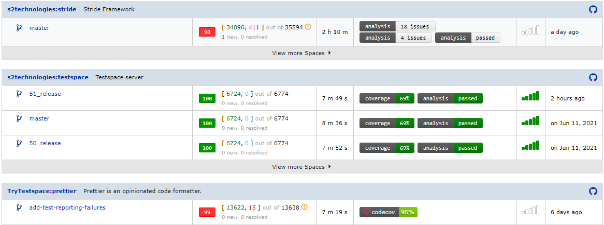

[](https://github.com/testspace-com/setup-testspace/actions/workflows/ci.yml) 


# Testspace client Setup Action
This [GitHub Action](https://github.com/features/actions) is used to install and configure the Testspace client for publishing test results to [Testspace.com](https://github.com/marketplace/testspace-com). 

- Supports `JUnit` and other results formats such as `NUnit`, `TRX`, etc.
- Supports `Linux`, `maxOS`, and `Windows`

[LIVE DASHBOARD](https://demo.testspace.com)

## Usage
Publish test results, code coverage, and other artifacts with one command. Seamless integration with your CI. Manage all your test status with a single dashboard providing history, metrics, and other types of insights. 

 ```yml
 steps:
   - uses: testspace-com/setup-testspace@v1
      with:
        domain: ${{github.repository_owner}}
        token: ${{ secrets.TESTSPACE_TOKEN }} # optional, only required for private repos
   ..
   - name: Publish Results to Testspace
     run: testspace testcontent/**/*.xml"
```

#### Input
The Testspace client action requires a `domain` and optionally a token for publishing test results.

* [Testspace domain](https://help.testspace.com/docs/dashboard/admin-signup) is the **organizational** name (*subdomain*) used when creating the account along with *.testspace.com*. The *.testspace.com* string is optional. 
* [Testspace access token](https://help.testspace.com/docs/dashboard/admin-user#account) is required when using a `private` repo. 

### Publish
Simple to publish test results, code coverage, custom metrics, etc., all with a single command using the Testspace client. 

- Automatically supports a `branch-based` process, forks, and `pull requests`
- Can also publish code coverage, and other artifacts (see [here](https://help.testspace.com/publish/push-data-results#file-content) for details)
- Aggregates results for [jobs](https://docs.github.com/en/actions/reference/workflow-syntax-for-github-actions#jobs), [matrix](https://docs.github.com/en/actions/reference/workflow-syntax-for-github-actions#jobsjob_idstrategy), and even **multiple workflows**

This sample repo - https://github.com/testspace-com/hello.publish - demonstrates support for jobs, matrix, and multiple workflows all executing based on the same commit. All of the published results are aggregated together as a single result set.

[CLICK HERE](http://testspace-com.testspace.com/projects/testspace-com:hello.publish/spaces/main) to review the *test results* from the `Hello Publish` sample. 

### Dashboard
Monitor the status of the software, regardless of the testing method. All the metrics; test results, code coverage, defects, requirements, etc., are collected and analyzed together. Testspace Dashboard provides:

* Built-in [metrics/graphs](https://help.testspace.com/dashboard/space-metrics)
* Extensive [Failure Tracking Management](https://help.testspace.com/dashboard/space-results#test-failures)
* Automatic [Flaky analysis](https://help.testspace.com/dashboard/space-results#filtering)
* [Insights](https://help.testspace.com/dashboard/project-insights) for process improvements

For more information on Publishing test results refer to the help [Overview on publishing](http://help.testspace.com/publish/overview). 




## Contributing 
Contributions are encouraged following the [Contribution Guide](CONTRIBUTING.md).


## License
This code is released under the [MIT License](LICENSE). 

